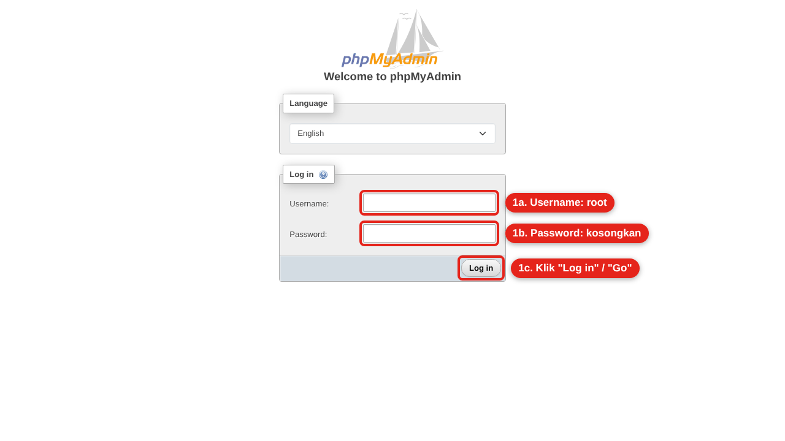
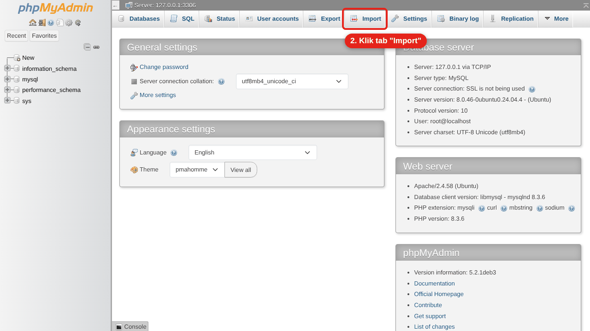
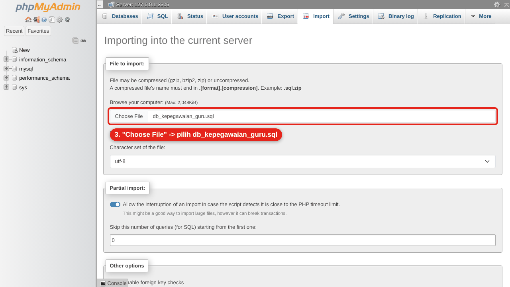
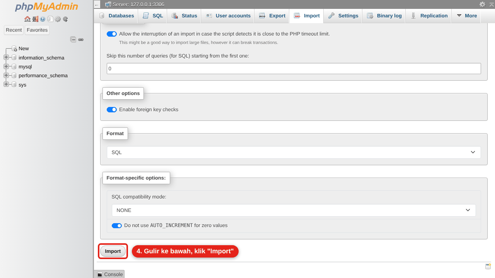
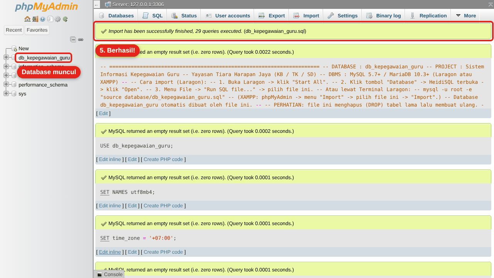

# Sistem Informasi Kepegawaian Guru
### Yayasan Tiara Harapan Jaya (KB / TK / SD)

Aplikasi kepegawaian guru berbasis **Flutter** (bisa dijalankan di **Android** dan **web/Chrome**) dengan backend **PHP + MySQL** yang dijalankan memakai **Laragon** (XAMPP juga bisa), atau memakai **Docker** agar versinya sama persis di setiap laptop.
Proyek tugas kelompok mata kuliah Manajemen Proyek Perangkat Lunak (MPPL), Universitas Bina Sarana Informatika.

---

## Progres pengembangan

Dikerjakan bertahap, mulai dari dasar seperti programmer pada umumnya.

| Sesi | Isi | Status |
|---|---|---|
| **1** | Fondasi proyek, rancangan database lengkap, API login/register, animasi splash & loading, Login, Register, Beranda Guru | ✅ Selesai |
| **2** | Info Kegiatan (daftar, cari, tandai penting, detail, unduh lampiran), banner info bergulir otomatis di Beranda, logo & foto Yayasan, nama + gelar terpisah, pengamanan login | ✅ Selesai |
| **3** | Jadwal Mengajar dengan **sistem jadwal mingguan** (guru: tab Senin–Jumat + pindah minggu; admin: atur jadwal per guru + cek bentrok), **Docker** | ✅ Selesai |
| 4 | Absen (foto + GPS, jam masuk/pulang) | ⏳ Berikutnya |
| 5 | Riwayat Absen (rekap per bulan, jam kerja) | ⏳ |
| 6 | Cuti / Izin (pengajuan, sisa kuota, status) | ⏳ |
| 7 | Pengaturan & Profil | ⏳ |
| 8+ | Halaman Admin: dashboard, data guru, kelola info, monitoring absensi, persetujuan cuti, laporan PDF/Excel, pengaturan sistem (kelola jadwal sudah dibuat di Sesi 3) | ⏳ |

### Yang baru di Sesi 3

- **Sistem jadwal mingguan.** Admin cukup mengatur jadwal **sekali** untuk setiap guru (hari, jam, unit, kelas, mata pelajaran). Jadwal itu otomatis **berulang setiap minggu**, seperti jadwal pelajaran di sekolah atau KRS di kampus. Jika ada perubahan, admin cukup mengubah jadwalnya dan perubahan berlaku untuk minggu-minggu berikutnya.
- **Jadwal Mengajar (guru)** sesuai desain: tab hari **Senin–Jumat** (tab **Sabtu** muncul jika guru punya jadwal Sabtu), kartu biru tua berisi daftar jam pelajaran, keterangan **Sedang berlangsung**/**Selesai** untuk hari ini, total jam mengajar per hari, serta tombol **‹ ›** untuk melihat jadwal minggu lalu/minggu depan. Tanggal yang ditetapkan sebagai **hari libur** ditandai otomatis.
- **Kelola Jadwal Mengajar (admin)**: login sebagai admin → **Kelola Jadwal Mengajar** → pilih guru → tambah/ubah/hapus jadwal per hari.
- **Cek jadwal bentrok otomatis**: sistem menolak jadwal jika guru yang sama sudah mengajar di jam itu, atau kelas yang sama sudah diajar guru lain di jam itu, lengkap dengan pesan penjelasannya.
- **Docker** (opsional): backend PHP, MySQL, dan phpMyAdmin bisa dijalankan dengan satu perintah dan versinya sama di setiap laptop. Lihat [bagian 8](#8-alternatif-menjalankan-backend-dengan-docker-opsional).
- Teks bawaan aplikasi (pemilih jam, tombol OK/Batal) kini berbahasa Indonesia.
- 2 akun guru demo baru (Siti Rahmawati & Ahmad Fauzi) beserta jadwal contohnya.

### Yang baru di Sesi 2

- **Info Kegiatan** (menu pertama di Beranda) sesuai desain: kolom pencarian, kartu info berisi tanggal dibuat & judul, **bintang** untuk menandai info penting, tombol **Penting** di kanan atas untuk menampilkan info yang ditandai saja, tombol **unduh** untuk info yang punya lampiran (contoh: PDF jadwal pengambilan raport), dan halaman **detail** info.
- **Banner Informasi Akademik** di Beranda kini berisi 5 info terbaru yang **bergulir otomatis ke atas setiap 5 detik** (bisa juga digeser manual). Setiap info menampilkan kategori dan tanggal dibuat; ketuk untuk membuka detailnya.
- **Logo Yayasan** menggantikan ikon toga (splash, login, Beranda, ikon aplikasi Android & web).
- **Foto bersama Yayasan** menjadi latar header halaman Login (filter navy) dan Beranda (memudar ke putih).
- Label unit (KB/TK/SD) di kartu hijau Beranda dihapus.
- Form register: **Nama Lengkap** dan **Gelar** (dropdown) dipisah. Nama tampil otomatis dengan gelar, mis. *Siti Aminah, S.Pd.* atau *Drs. Budi Santoso*.
- **Pengamanan login**: setelah 5 kali salah kata sandi, akun dikunci sementara 15 menit (berlaku untuk login lewat email maupun NIY).

### Yang sudah bisa dicoba (Sesi 1)

- **Splash screen** dengan animasi logo + animasi loading titik memantul, sekaligus cek otomatis apakah masih login.
- **Login** memakai email **atau** Nomor Induk Yayasan (NIY), tombol lihat/sembunyikan kata sandi, overlay loading.
- **Register** akun guru dengan validasi lengkap (nama, NIY, email, no. HP, unit, jenis kelamin, kata sandi).
- **Beranda Guru** sesuai desain: header foto sekolah + logo, foto profil, kartu identitas hijau (Nama, NIY, Jabatan), banner Informasi Akademik, dan 7 menu.
- **Logout**, dan sesi tetap tersimpan (tidak perlu login ulang setiap membuka aplikasi).
- Login sebagai **admin** masuk ke halaman Dashboard Admin sementara.
- Menu yang belum dibuat membuka halaman "Sedang dalam tahap pengembangan".

---

## Struktur folder

```
kepegawaian-guru/
├── aplikasi/     -> aplikasi Flutter (Android + Web)
│   ├── lib/
│   │   ├── config/     (alamat API, warna, tema, daftar halaman)
│   │   ├── models/     (bentuk data, mis. Pengguna)
│   │   ├── services/   (komunikasi ke API & penyimpanan sesi)
│   │   ├── screens/    (halaman: splash, login, register, beranda, ...)
│   │   ├── widgets/    (komponen yang dipakai ulang: tombol, input, loading)
│   │   └── utils/      (validasi form, pesan snackbar)
│   ├── assets/   (font Poppins & gambar)
│   └── test/     (unit test & widget test)
├── backend/      -> API PHP (lihat backend/README.md)
├── database/     -> file SQL + ERD & Kamus Data (lihat database/README.md)
├── docker/       -> resep Docker (backend PHP & aplikasi web)
├── docs/         -> gambar panduan
├── docker-compose.yml -> daftar layanan Docker (backend, MySQL, phpMyAdmin)
└── .vscode/      -> konfigurasi tombol Run (F5) di VS Code
```

---

## 1. Persiapan (cukup sekali)

Pasang aplikasi berikut di laptop (Windows):

1. **Laragon** (berisi Apache + MySQL + PHP + phpMyAdmin) — <https://laragon.org/download>
2. **Git** — <https://git-scm.com/download/win>
3. **Flutter SDK** versi **3.41 atau lebih baru** (disarankan versi stable terbaru) — ikuti panduan <https://docs.flutter.dev/get-started/install/windows>
4. **Android Studio** — dibutuhkan untuk Android SDK (agar bisa menjalankan di HP).
5. **VS Code** + ekstensi **Flutter** dan **Dart** (VS Code akan menyarankannya otomatis saat folder proyek dibuka).

Cek instalasi Flutter di terminal VS Code (`Ctrl + ~`):

```bash
flutter --version
flutter doctor
```

Pastikan `flutter doctor` tidak menunjukkan tanda ❌ pada bagian Flutter, Android toolchain, dan Chrome.

> **Pengaturan Laragon yang dipakai proyek ini** (semuanya bawaan Laragon, tidak perlu diubah):
> web server **Apache**, MySQL port **3306**, user **root** tanpa kata sandi.
> Jika kamu pernah memberi kata sandi pada user root MySQL, isi kata sandinya di `backend/config/database.php`.

---

## 2. Mengambil proyek dari GitHub (pertama kali)

Proyek diletakkan di folder `www` milik Laragon supaya backend PHP langsung bisa diakses Apache.
Buka VS Code → **Terminal → New Terminal**, lalu jalankan:

```bash
cd C:\laragon\www
git clone https://github.com/pentest-acc/kepegawaian-guru.git
cd kepegawaian-guru
code .
```

> - Jika diminta login GitHub, login dengan akun pemilik repository.
> - `code .` membuka folder proyek di VS Code (atau buka manual: **File → Open Folder** → `C:\laragon\www\kepegawaian-guru`).
> - Lokasi folder `www` bisa dicek lewat tombol **Root** di Laragon. Jika Laragon dipasang di drive lain (mis. `D:\laragon`), sesuaikan perintah `cd`-nya.

Lalu unduh paket-paket Flutter:

```bash
cd aplikasi
flutter pub get
```

## 3. Menyalakan Laragon & menyiapkan database

1. Buka **Laragon**, klik **Start All** (Apache dan MySQL menyala).
   Jika Windows menampilkan peringatan Firewall untuk Apache/httpd, centang **Private networks** lalu klik **Allow access** (dibutuhkan agar HP bisa terhubung).
2. Import database, pilih salah satu cara:

   **Cara A — phpMyAdmin (lewat tombol Database di Laragon)**

   File SQL proyek ini **sudah berisi perintah untuk membuat database-nya sendiri**, jadi kamu **tidak perlu** membuat database baru dulu dan **tidak perlu** memilih database apa pun di panel kiri.

   1. Di Laragon klik tombol **Database**. Browser akan membuka phpMyAdmin.
      Jika muncul halaman login, isi **Username** `root`, **kosongkan Password**, lalu klik **Log in** (atau **Go**).

      

   2. Di deretan menu atas, klik tab **Import** (jika phpMyAdmin berbahasa Indonesia: **Impor**).

      

   3. Pada bagian **File to import**, klik **Choose File** (atau **Browse** / **Pilih File**), lalu buka file
      `C:\laragon\www\kepegawaian-guru\database\db_kepegawaian_guru.sql`.
      Pengaturan lain (Character set `utf-8`, Format `SQL`) biarkan apa adanya.

      

   4. Gulir ke paling bawah, klik tombol **Import** (atau **Go** / **Kirim**).

      

   5. Jika berhasil, muncul kotak hijau **"Import has been successfully finished, 29 queries executed"** dan database `db_kepegawaian_guru` muncul di panel kiri (klik untuk melihat 9 tabelnya).

      

   > **Cara cadangan** jika tombol Choose File bermasalah: buka file `database/db_kepegawaian_guru.sql` di VS Code → tekan `Ctrl + A` lalu `Ctrl + C` → di phpMyAdmin klik tab **SQL** → klik kotak teksnya, tekan `Ctrl + V` → klik **Go** (pojok kanan bawah). Hasilnya beberapa kotak hijau, dan `db_kepegawaian_guru` muncul di panel kiri setelah halaman di-refresh (`F5`).
   >
   > Laragon versi lama membuka **HeidiSQL** (bukan phpMyAdmin) saat tombol Database diklik. Di HeidiSQL: klik **Open** → menu **File → Run SQL file...** → pilih file SQL di atas → tekan **F5** untuk refresh.

   **Cara B — Terminal Laragon**
   Di Laragon klik tombol **Terminal**, lalu ketik:

   ```bash
   cd C:\laragon\www\kepegawaian-guru
   mysql -u root -e "source database/db_kepegawaian_guru.sql"
   ```

   > Perintah `mysql` bisa juga dipakai di terminal VS Code setelah mengaktifkan
   > **Menu Laragon → Tools → Path → Add Laragon to Path**, lalu tutup & buka lagi VS Code.

3. Cek backend: buka <http://localhost/kepegawaian-guru/backend/api/> di browser. Jika tampil tulisan seperti ini, backend sudah siap:

   ```json
   {"sukses":true,"pesan":"API Kepegawaian Guru berjalan dengan baik.", ...}
   ```

   (Laragon juga otomatis membuat alamat cantik <http://kepegawaian-guru.test/backend/api/> setelah Laragon di-*Reload*. Alamat `.test` ini hanya bisa dibuka dari laptop, jadi aplikasi tetap memakai alamat `localhost`/IP laptop.)

## 4. Menjalankan aplikasi di Chrome (paling mudah)

Dari folder `aplikasi`:

```bash
flutter run -d chrome
```

Atau di VS Code tekan **F5** → pilih **"Aplikasi - Chrome (web)"**.

## 5. Menjalankan aplikasi di HP Android

1. **Sambungkan HP dan laptop ke Wi-Fi yang sama.**
2. Cari IP laptop: buka CMD/terminal, ketik `ipconfig`, lihat **IPv4 Address** di bagian Wi-Fi (contoh `192.168.1.7`).
3. Buka file `aplikasi/lib/config/api_config.dart`, ganti nilai `ipLaptop`:
   ```dart
   static const String ipLaptop = '192.168.1.7';
   ```
4. Tes dulu dari **browser HP**: buka `http://192.168.1.7/kepegawaian-guru/backend/api/`.
   Jika JSON-nya tampil, HP sudah bisa menghubungi laptop. Jika tidak, izinkan **Apache** di Windows Firewall (lihat Troubleshooting).
5. Aktifkan **Opsi Pengembang** di HP (Pengaturan → Tentang ponsel → ketuk **Nomor versi/Build number** 7×), lalu nyalakan **Debugging USB**.
6. Colok HP ke laptop dengan kabel USB, izinkan debugging di HP, lalu jalankan:
   ```bash
   flutter devices
   flutter run
   ```
   Atau tekan **F5** di VS Code → **"Aplikasi - HP Android / perangkat terpilih"** (pilih HP di pojok kanan bawah VS Code).

Membuat file APK untuk dipasang/dibagikan:

```bash
flutter build apk --release
```

File APK ada di `aplikasi/build/app/outputs/flutter-apk/app-release.apk`.

## 6. Akun demo

| Role | Login (Email atau NIY) | Kata sandi |
|---|---|---|
| Guru (SD) | `guru@contoh.test` atau `12345678910` | `guru123` |
| Guru (TK) | `siti@contoh.test` atau `12345678911` | `guru123` |
| Guru (SD, PAI) | `ahmad@contoh.test` atau `12345678912` | `guru123` |
| Admin | `admin@contoh.test` atau `ADM001` | `admin123` |

Bisa juga membuat akun guru sendiri lewat tombol **Daftar di sini** di halaman login.

Mencoba sistem jadwal: login sebagai **Admin** → **Kelola Jadwal Mengajar** → pilih guru → ubah/tambah jadwal. Lalu logout, login sebagai guru tersebut → menu **Jadwal Mengajar**: perubahan langsung terlihat, dan berlaku juga di minggu-minggu berikutnya (tekan tombol **›**).

---

## 7. Mengambil pembaruan dari sesi berikutnya

Setiap sesi selesai, hasilnya dikirim sebagai **Pull Request** ke branch `main`. Setelah Pull Request di-*merge* di GitHub, ambil kode terbarunya dari terminal VS Code:

```bash
cd C:\laragon\www\kepegawaian-guru
git checkout main
git pull
cd aplikasi
flutter pub get
```

> Jika sesi berikutnya mengubah database, akan ada file SQL tambahan + petunjuknya. Jangan import ulang `db_kepegawaian_guru.sql` kalau database sudah berisi data asli, karena file itu menghapus tabel lama.

### Pembaruan database Sesi 3 (wajib, cukup sekali)

Sesi 3 menambah index untuk pengecekan jadwal bentrok, 2 akun guru demo, dan jadwal contoh. Pilih **salah satu**:

- **Cara mudah (data lama boleh hilang)** — import ulang `database/db_kepegawaian_guru.sql` lewat phpMyAdmin seperti langkah 3.
- **Cara aman (data lama dipertahankan)** — di phpMyAdmin klik tab **Import**, pilih file `database/migrasi/2026-10-10_sesi3.sql`, lalu klik **Import**. Jadwal contoh hanya ditambahkan untuk akun demo yang belum punya jadwal. (Jika migrasi Sesi 2 belum pernah dijalankan, jalankan `2026-10-09_sesi2.sql` dulu.)

Setelah itu jalankan `flutter pub get`, lalu **stop** aplikasi dan jalankan ulang (`flutter run`), karena ada paket baru (`flutter_localizations`).

### Pembaruan database Sesi 2

Hanya untuk yang belum memperbarui database di Sesi 2. Sesi 2 menambah kolom `gelar`, tabel `percobaan_login`, dan info kegiatan contoh. Pilih **salah satu**:

- **Cara mudah (data lama boleh hilang)** — import ulang `database/db_kepegawaian_guru.sql` lewat phpMyAdmin seperti langkah 3. Semua tabel dibuat ulang (akun yang pernah kamu daftarkan sendiri ikut terhapus; akun demo tetap ada).
- **Cara aman (data lama dipertahankan)** — di phpMyAdmin klik tab **Import**, pilih file `database/migrasi/2026-10-09_sesi2.sql`, lalu klik **Import**. Nama yang sudah berisi gelar (mis. "Siti Aminah, S.Pd.") otomatis dipisah menjadi nama + gelar.

Setelah itu jalankan ulang aplikasi (`flutter run`), karena ada gambar & paket baru (`url_launcher`).

### Memakai XAMPP (opsional)

Proyek ini juga berjalan di XAMPP tanpa perubahan kode: clone ke `C:\xampp\htdocs` (bukan `C:\laragon\www`), nyalakan Apache & MySQL dari XAMPP Control Panel, lalu import SQL lewat <http://localhost/phpmyadmin> (tab **Import**).

---

## 8. Alternatif: menjalankan backend dengan Docker (opsional)

**Docker** membungkus PHP, MySQL, dan phpMyAdmin dalam "kontainer" dengan versi yang **sudah dikunci** (PHP 8.3, MySQL 8.4, phpMyAdmin 5.2). Hasilnya sama persis di laptop siapa pun, jadi tidak ada lagi masalah "di laptopku jalan, di laptopmu error". Database juga **otomatis di-import** saat pertama kali dinyalakan.

Laragon tetap bisa dipakai seperti biasa; Docker hanyalah pilihan lain. **Jangan nyalakan keduanya bersamaan** jika memakai port yang sama.

**Persiapan (sekali):**

1. Pasang **Docker Desktop** — <https://www.docker.com/products/docker-desktop/>. Saat instalasi, biarkan opsi **Use WSL 2** tercentang. Restart laptop jika diminta.
2. Buka Docker Desktop dan tunggu sampai tulisan **Engine running** (ikon paus di taskbar berhenti bergerak).

**Menyalakan** (di terminal VS Code, dari folder proyek):

```bash
cd C:\laragon\www\kepegawaian-guru
docker compose up -d
```

Pertama kali akan mengunduh ± 1 GB, jadi butuh beberapa menit. Berikutnya hanya beberapa detik. Setelah selesai:

| Layanan | Alamat | Keterangan |
|---|---|---|
| Backend API | <http://localhost:8080/kepegawaian-guru/backend/api/> | Harus tampil `"sukses": true` |
| phpMyAdmin | <http://localhost:8081> | Username `kepegawaian`, password `kepegawaian123` (atau `root` / `root_rahasia`) |
| MySQL | `localhost:3307` | Untuk HeidiSQL/DBeaver jika perlu |

**Menjalankan aplikasi Flutter dengan backend Docker:**

- Chrome: tekan **F5** di VS Code → pilih **"Aplikasi - Chrome (backend Docker)"**, atau dari folder `aplikasi`:
  ```bash
  flutter run -d chrome --dart-define=API_URL=http://localhost:8080/kepegawaian-guru/backend/api
  ```
- HP Android (satu Wi-Fi dengan laptop, ganti IP-nya):
  ```bash
  flutter run --dart-define=API_URL=http://192.168.1.7:8080/kepegawaian-guru/backend/api
  ```
  Jika HP tidak bisa membuka alamat itu, izinkan **Docker Desktop** di Windows Firewall untuk jaringan Private.

**Perintah lain yang sering dipakai:**

```bash
docker compose ps          # melihat status layanan
docker compose logs -f     # melihat log (keluar: Ctrl + C)
docker compose down        # mematikan (data database tetap tersimpan)
docker compose down -v     # mematikan + MENGHAPUS database (import ulang otomatis saat up berikutnya)
```

> - Kode backend dibaca langsung dari folder `backend/`, jadi setelah `git pull` perubahan PHP langsung berlaku tanpa perlu build ulang.
> - Database di Docker **terpisah** dari database Laragon. Jika ada pembaruan database di sesi berikutnya, import file migrasinya lewat phpMyAdmin Docker (<http://localhost:8081>), atau jalankan `docker compose down -v` lalu `docker compose up -d` untuk mulai dari awal.
> - Port atau kata sandi bisa diubah: salin `.env.example` menjadi `.env`, ubah isinya, lalu `docker compose up -d` lagi.
> - **Opsional:** aplikasi versi web juga bisa dibangun di Docker tanpa memasang Flutter: `docker compose --profile web up -d --build`, lalu buka <http://localhost:8082>. Proses build pertama cukup lama (mengunduh Flutter ± 1 GB).

---

## Rencana online (nanti)

Agar aplikasi bisa dipakai dari mana saja (bukan hanya satu Wi-Fi), backend + database perlu ditaruh di server internet:

| Pilihan | Cocok untuk | Perkiraan biaya |
|---|---|---|
| **Shared hosting** (cPanel, sudah ada PHP + MySQL + phpMyAdmin) | Paling mudah, cara kerjanya mirip Laragon | ± Rp15–50 ribu/bulan + domain |
| **VPS** (server sendiri) + Docker | Lebih fleksibel, bisa memakai `docker-compose.yml` proyek ini | ± Rp50–100 ribu/bulan + domain |

- **Database ikut online** di hosting/VPS yang sama (di shared hosting dibuat lewat menu *MySQL Databases*, lalu file SQL di-import lewat phpMyAdmin hosting).
- **Domain**: misalnya `.my.id`/`.web.id` (murah), `.com`/`.id`, atau `.sch.id` (khusus sekolah, butuh dokumen resmi sekolah).
- **Cloudflare** (gratis) bukan tempat database; fungsinya sebagai pengelola DNS domain, HTTPS (gembok), dan pelindung dari serangan.
- Yang perlu diubah di proyek: alamat API di aplikasi (`--dart-define=API_URL=https://domain-kamu/backend/api`), isi `backend/config/database.php` (atau variabel lingkungan `DB_*`), dan `tampilkan_error` menjadi `false` di `backend/config/app.php`. Wajib memakai **HTTPS**.

---

## Gambar Yayasan (logo & foto header)

Gambar ada di `aplikasi/assets/images/`:

- `logo_yayasan.png` — logo Yayasan (splash, login, Beranda)
- `header_sekolah.jpg` — foto bersama untuk latar header Login & Beranda

Untuk mengganti, timpa file tersebut dengan gambar baru (nama file sama), **stop** aplikasi, lalu jalankan ulang (`flutter run`). Ikon aplikasi Android ada di `aplikasi/android/app/src/main/res/mipmap-*/ic_launcher.png` dan ikon web di `aplikasi/web/`.

## Keamanan login

- Login bisa memakai **email** atau **Nomor Induk Yayasan (NIY)**. Keduanya hanya berfungsi sebagai *nama pengguna*; yang benar-benar melindungi akun adalah **kata sandi** (disimpan sebagai hash bcrypt, tidak bisa dibaca siapa pun).
- Untuk mencegah orang menebak-nebak kata sandi, akun dikunci **15 menit** setelah **5 kali** salah kata sandi (dihitung per akun, jadi tidak bisa diakali dengan bergantian memakai email lalu NIY). Angka ini bisa diubah di `backend/config/app.php`.

## Menjalankan test

```bash
cd aplikasi
flutter analyze
flutter test
```

---

## Troubleshooting

| Masalah | Solusi |
|---|---|
| "Tidak dapat terhubung ke server" | Pastikan Laragon sudah **Start All**. Di HP: cek `ipLaptop` di `api_config.dart` dan HP satu Wi-Fi dengan laptop. |
| Browser HP tidak bisa membuka `http://IP-laptop/...` | Windows Firewall memblokir Apache. Buka **Windows Defender Firewall → Allow an app** → centang **Apache HTTP Server** (httpd) untuk jaringan **Private**. Pastikan jaringan Wi-Fi di Windows diset sebagai *Private*. |
| phpMyAdmin menolak login (`#1045 Access denied` atau *"Login without a password is forbidden"*) | Login dengan username `root` dan password kosong. Jika muncul pesan *forbidden*, buka file `config.inc.php` milik phpMyAdmin di Laragon (biasanya `C:\laragon\etc\apps\phpMyAdmin\config.inc.php`) lalu tambahkan baris `$cfg['Servers'][$i]['AllowNoPassword'] = true;`. Jika root MySQL kamu memakai password, isi password itu juga di `backend/config/database.php`. |
| "Gagal terhubung ke database" | MySQL di Laragon belum menyala, atau database belum di-import (langkah 3). Jika user root MySQL memakai kata sandi, isi di `backend/config/database.php`. |
| Setiap aplikasi dibuka ulang selalu kembali ke halaman Login | Apache membuang header token. Pastikan file `backend/.htaccess` ikut ter-clone (file tersembunyi) dan Laragon memakai **Apache** (Menu → Preferences → Services & Ports). |
| Apache tidak mau menyala karena port 80 dipakai | Matikan aplikasi yang memakai port 80 (mis. IIS/Skype), atau ganti port Apache di Laragon (Menu → Preferences → Services & Ports) lalu jalankan aplikasi dengan `flutter run --dart-define=API_URL=http://localhost:PORT/kepegawaian-guru/backend/api`. |
| `flutter pub get` gagal karena versi SDK | Perbarui Flutter: `flutter upgrade`. |
| `docker` tidak dikenali / *"cannot connect to the Docker daemon"* | Pastikan Docker Desktop sudah dibuka dan statusnya **Engine running**, lalu tutup & buka lagi terminal VS Code. |
| Docker: *"port is already allocated"* | Port 8080/8081/3307 dipakai aplikasi lain (mis. Laragon). Matikan aplikasi itu, atau salin `.env.example` menjadi `.env` dan ganti nomor portnya. |
| Docker: halaman API menampilkan *"Gagal terhubung ke database"* | MySQL di Docker masih menyiapkan database (± 30 detik saat pertama kali). Cek dengan `docker compose ps` sampai `db` berstatus **healthy**. |
| Jadwal Mengajar guru kosong | Admin belum mengatur jadwal guru tersebut (Kelola Jadwal Mengajar), atau database belum diperbarui ke Sesi 3. |
| Folder proyek bukan `kepegawaian-guru` | Ubah `folderProyek` di `aplikasi/lib/config/api_config.dart`. |
