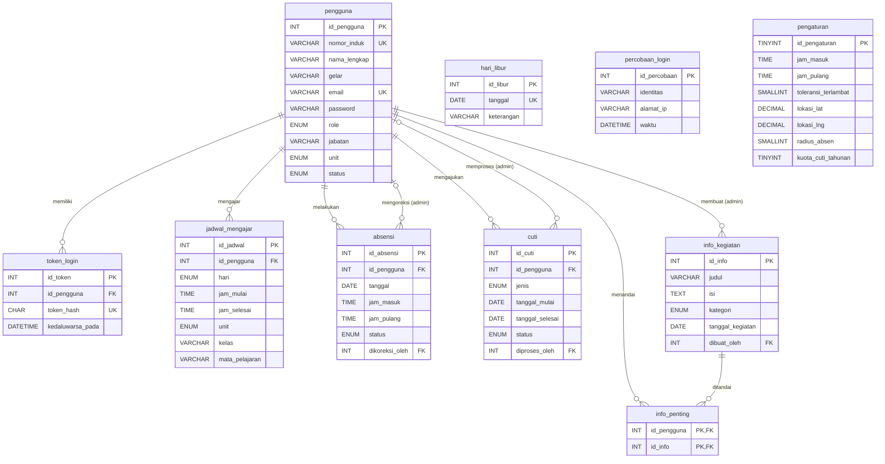

# Database `db_kepegawaian_guru`

File SQL: [`db_kepegawaian_guru.sql`](db_kepegawaian_guru.sql). Bisa langsung di-import lewat phpMyAdmin (tombol **Database** di Laragon) — langkah bergambar ada di [README utama](../README.md#3-menyalakan-laragon--menyiapkan-database). Sudah diuji di MySQL 8.0, MySQL 8.4 (Docker), MariaDB 10.11, dan phpMyAdmin 5.2.

Jika memakai Docker (`docker compose up -d`), file ini otomatis di-import saat database Docker pertama kali dibuat.

> Struktur database dirancang lengkap dari awal sesuai Project Charter, jadi semua tabel sudah ada walaupun fiturnya dibuat bertahap.
> Bagian ini juga bisa dipakai sebagai bahan **ERD** dan **Kamus Data** untuk tugas analisa & desain sistem.

## ERD (Entity Relationship Diagram)

## Kamus Data

Keterangan: **PK** = Primary Key, **FK** = Foreign Key, **UK** = Unique Key.

### 1. `pengguna` — akun login & biodata Guru/Admin

| Kolom | Tipe | Keterangan |
|---|---|---|
| id_pengguna | INT, PK, auto increment | ID pengguna |
| nomor_induk | VARCHAR(30), UK | Nomor Induk Yayasan (NIY), bisa dipakai login |
| nama_lengkap | VARCHAR(100) | Nama lengkap **tanpa** gelar |
| gelar | VARCHAR(30) | Gelar akademik, mis. `S.Pd.`, `S.Pd., M.Pd.`, `Drs.` (kosong jika tanpa gelar) |
| email | VARCHAR(100), UK | Email, bisa dipakai login |
| no_hp | VARCHAR(20) | Nomor HP/WhatsApp |
| password | VARCHAR(255) | Hash bcrypt (kata sandi asli **tidak** disimpan) |
| role | ENUM('guru','admin') | Hak akses |
| jabatan | VARCHAR(50) | Contoh: Guru Kelas, Wali Kelas |
| unit | ENUM('KB','TK','SD') | Unit tempat mengajar (kosong untuk admin) |
| jenis_kelamin | ENUM('L','P') | Laki-laki / Perempuan |
| tempat_lahir, tanggal_lahir, alamat | VARCHAR / DATE / TEXT | Biodata (diisi di menu Profil) |
| foto | VARCHAR(255) | Lokasi file foto profil |
| notifikasi_aktif | BOOLEAN (TINYINT(1)) | Pengaturan notifikasi (1 = aktif) |
| status | ENUM('aktif','nonaktif') | Akun nonaktif tidak bisa login |
| dibuat_pada, diubah_pada | DATETIME | Waktu data dibuat/diubah |

### 2. `token_login` — sesi login di setiap perangkat

| Kolom | Tipe | Keterangan |
|---|---|---|
| id_token | INT, PK | ID token |
| id_pengguna | INT, FK → pengguna | Pemilik token |
| token_hash | CHAR(64), UK | Hash SHA-256 dari token di aplikasi |
| perangkat | VARCHAR(100) | Android / Web |
| dibuat_pada | DATETIME | Waktu login |
| kedaluwarsa_pada | DATETIME | Token tidak berlaku setelah waktu ini (default 30 hari) |

### 2b. `percobaan_login` — catatan login yang gagal

Dipakai untuk mengunci sementara akun yang kata sandinya salah 5 kali (15 menit). Tidak berelasi langsung dengan tabel lain karena orang bisa saja mencoba login dengan email yang tidak terdaftar.

| Kolom | Tipe | Keterangan |
|---|---|---|
| id_percobaan | INT, PK | ID catatan |
| identitas | VARCHAR(100) | `akun:<id_pengguna>` jika akunnya ada, atau email/NIY yang dicoba jika tidak terdaftar |
| alamat_ip | VARCHAR(45) | Alamat IP perangkat yang mencoba |
| waktu | DATETIME | Waktu percobaan gagal (catatan > 1 hari dihapus otomatis) |

### 3. `info_kegiatan` — informasi & pengumuman Yayasan

| Kolom | Tipe | Keterangan |
|---|---|---|
| id_info | INT, PK | ID info |
| judul | VARCHAR(150) | Judul kegiatan |
| isi | TEXT | Isi/keterangan |
| kategori | ENUM | Pengumuman, Rapat, Acara, Libur, Lainnya |
| tanggal_kegiatan | DATE | Tanggal kegiatan |
| lampiran | VARCHAR(255) | Nama file di `backend/uploads/lampiran/` yang bisa diunduh guru |
| status | ENUM('draf','terbit') | Hanya yang `terbit` tampil di aplikasi guru |
| dibuat_oleh | INT, FK → pengguna | Admin pembuat |
| dibuat_pada | DATETIME | Waktu info diumumkan (ditampilkan di daftar & banner Beranda) |

### 4. `info_penting` — info yang ditandai bintang oleh guru

| Kolom | Tipe | Keterangan |
|---|---|---|
| id_pengguna | INT, PK, FK → pengguna | Guru |
| id_info | INT, PK, FK → info_kegiatan | Info yang ditandai |
| ditandai_pada | DATETIME | Waktu ditandai |

### 5. `jadwal_mengajar` — jadwal mingguan guru

Tabel ini menyimpan **pola mingguan** (hari + jam), bukan tanggal. Satu baris = satu jam pelajaran yang **berulang setiap minggu**, jadi admin cukup mengisi sekali. Untuk menampilkan jadwal pada tanggal tertentu, aplikasi mencocokkan nama harinya (mis. 12 Oktober 2026 = Senin) lalu mengecek tabel `hari_libur`.

| Kolom | Tipe | Keterangan |
|---|---|---|
| id_jadwal | INT, PK | ID jadwal |
| id_pengguna | INT, FK → pengguna | Guru yang mengajar |
| hari | ENUM('Senin'..'Sabtu') | Hari mengajar |
| jam_mulai, jam_selesai | TIME | Jam pelajaran |
| unit | ENUM('KB','TK','SD') | Unit |
| kelas | VARCHAR(20) | Contoh: 3A, TK A (disimpan huruf besar) |
| mata_pelajaran | VARCHAR(100) | Mata pelajaran / kegiatan |

Index: `idx_jadwal_guru_hari (id_pengguna, hari)` dan `idx_jadwal_kelas_hari (unit, kelas, hari)` untuk mempercepat pengecekan **jadwal bentrok**. Dua jadwal dianggap bentrok jika harinya sama dan jamnya beririsan (`jam_mulai_lama < jam_selesai_baru` **dan** `jam_selesai_lama > jam_mulai_baru`), baik untuk guru yang sama maupun untuk kelas yang sama.

### 6. `absensi` — absen masuk & pulang (foto + GPS)

| Kolom | Tipe | Keterangan |
|---|---|---|
| id_absensi | INT, PK | ID absensi |
| id_pengguna | INT, FK → pengguna | Guru |
| tanggal | DATE | Tanggal absen (UK bersama id_pengguna: 1 baris per hari) |
| jam_masuk, jam_pulang | TIME | Jam absen |
| foto_masuk, foto_pulang | VARCHAR(255) | Foto saat absen |
| lat_masuk, lng_masuk, lat_pulang, lng_pulang | DECIMAL(10,7) | Lokasi GPS saat absen |
| status | ENUM | hadir, terlambat, izin, sakit, cuti, alpa |
| menit_terlambat | SMALLINT | Lama terlambat (menit) |
| keterangan | VARCHAR(255) | Catatan / alasan koreksi |
| dikoreksi_oleh | INT, FK → pengguna | Admin yang mengoreksi |

### 7. `cuti` — pengajuan cuti/izin/sakit

| Kolom | Tipe | Keterangan |
|---|---|---|
| id_cuti | INT, PK | ID pengajuan |
| id_pengguna | INT, FK → pengguna | Guru yang mengajukan |
| jenis | ENUM('cuti','izin','sakit') | Jenis pengajuan |
| tanggal_mulai, tanggal_selesai | DATE | Rentang tanggal |
| jumlah_hari | SMALLINT | Jumlah hari kerja |
| alasan | TEXT | Alasan |
| lampiran | VARCHAR(255) | Misalnya surat dokter |
| status | ENUM | menunggu, disetujui, ditolak |
| catatan_admin | VARCHAR(255) | Catatan dari admin |
| diproses_oleh | INT, FK → pengguna | Admin yang memproses |
| diproses_pada | DATETIME | Waktu diproses |

### 8. `hari_libur`

| Kolom | Tipe | Keterangan |
|---|---|---|
| id_libur | INT, PK | ID |
| tanggal | DATE, UK | Tanggal libur |
| keterangan | VARCHAR(100) | Contoh: Hari Raya Natal |

### 9. `pengaturan` — pengaturan sistem (1 baris)

| Kolom | Tipe | Keterangan |
|---|---|---|
| id_pengaturan | TINYINT, PK | Selalu 1 |
| nama_yayasan, alamat_yayasan | VARCHAR | Identitas Yayasan |
| jam_masuk, jam_pulang | TIME | Default 07:00 & 14:00 |
| toleransi_terlambat | SMALLINT | Menit (default 15) |
| lokasi_lat, lokasi_lng | DECIMAL(10,7) | Titik lokasi absen (diisi admin) |
| radius_absen | SMALLINT | Jarak maksimal absen dari titik lokasi (meter) |
| kuota_cuti_tahunan | TINYINT | Jatah cuti per tahun (hari) |

## Riwayat perubahan (migrasi)

| File | Isi |
|---|---|
| `migrasi/2026-10-09_sesi2.sql` | Sesi 2: kolom `pengguna.gelar` (nama bergelar lama dipisah otomatis), tabel `percobaan_login`, 5 info kegiatan contoh + lampiran, alamat Yayasan |
| `migrasi/2026-10-10_sesi3.sql` | Sesi 3: index `idx_jadwal_kelas_hari`, 2 akun guru demo, jadwal mengajar contoh (hanya untuk akun demo yang belum punya jadwal). Aman dijalankan ulang |

File migrasi hanya untuk database lama yang datanya ingin dipertahankan. Untuk instalasi baru cukup import `db_kepegawaian_guru.sql`.

## Akun demo

| Role | Login (Email / NIY) | Kata sandi |
|---|---|---|
| Admin | `admin@contoh.test` / `ADM001` | `admin123` |
| Guru (SD) | `guru@contoh.test` / `12345678910` | `guru123` |
| Guru (TK) | `siti@contoh.test` / `12345678911` | `guru123` |
| Guru (SD) | `ahmad@contoh.test` / `12345678912` | `guru123` |

Ganti kata sandi akun demo sebelum aplikasi dipakai sungguhan.
